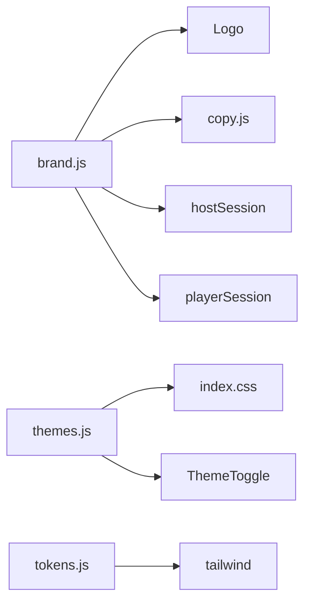

# Finish Kheelan Rebrand

## Current state

Most identity work is **done and building cleanly** (`npm run build --prefix client` passes):

- [brand.js](client/src/lib/brand.js) — `Kheelan`, `kheelan.*` storage keys + legacy fallback
- [themes.js](client/src/lib/themes.js) — Light/Dark (+ legacy blue/classic migration)
- [tokens.js](client/src/lib/tokens.js), [index.css](client/src/index.css) — indigo SaaS palette, Plus Jakarta Sans
- [Logo.jsx](client/src/components/Logo.jsx), [index.html](client/index.html) — K lettermark, favicon, title
- [copy.js](client/src/lib/copy.js), [Landing.jsx](client/src/pages/Landing.jsx) — SaaS tone, no family popup
- [App.jsx](client/src/App.jsx) — `FamilyWelcomePopup` removed
- [Recap.jsx](client/src/components/Recap.jsx) — uses `BRAND.name`, "Session recap"
- Server banner / User-Agent updated

## Remaining work (moderate polish scope)

### 1. Rename sweep (user-visible + docs)

Replace **Alkheeloot** references in comments/docs/config (not npm package names or `--alkheelank-*` CSS):

| File | Change |
|------|--------|
| [README.md](README.md) | Line 10: drop "family/friends" framing; line 149: `Alkheeloot/` → `Kheelan/` |
| [server/package.json](server/package.json) | description → Kheelan |
| [render.yaml](render.yaml) | comment |
| [client/.env.example](client/.env.example) | comment |
| [supabase/schema.sql](supabase/schema.sql) | header comment |
| [scripts/setup.ps1](scripts/setup.ps1), [scripts/verify-setup.mjs](scripts/verify-setup.mjs) | console strings |
| [scripts/fetch-starter-images.mjs](scripts/fetch-starter-images.mjs) | User-Agent |
| [client/src/index.css](client/src/index.css) | comment ~L2428 |
| [client/src/components/characters.jsx](client/src/components/characters.jsx) | file comment |
| [client/src/lib/waitingMessages.js](client/src/lib/waitingMessages.js) | file comment (tone tweak, not content rewrite) |
| [client/src/pages/QuestionPreview.jsx](client/src/pages/QuestionPreview.jsx) | picsum seed `kheelan` |

**Leave unchanged (explicitly out of scope):** starter quiz id `family-faceoff`, QuizEditor audience option "Family", npm name `alkheelank-client`, CSS class prefix `alkheelank-*`.

### 2. Remove orphaned family UI

Both components are **unreferenced** — safe to delete:

- [FamilyWelcomePopup.jsx](client/src/components/FamilyWelcomePopup.jsx)
- [BuiltByHamza.jsx](client/src/components/BuiltByHamza.jsx)

### 3. Component polish (moderate)

**Auth** ([Auth.jsx](client/src/pages/Auth.jsx)):

- Login/signup tab active state: `bg-brand-gradient-2` → `bg-brand-mid` (solid indigo, matches new btn-primary)

**Dashboard** ([Dashboard.jsx](client/src/pages/Dashboard.jsx)):

- Quiz card actions: `✏️ Edit` → `Edit`, `▶ Host` → `Host` (text-only or simple SVG icons if already used elsewhere)
- Starter card fallback emoji overlay: keep category emoji in data but remove large decorative `quiz.emoji || "🎯"` if it reads too playful — use category initial or cover-only
- Primary CTA buttons: `bg-brand-gradient-2` → `alkheelank-btn-primary` for consistency

**Lobby** ([LobbyView.jsx](client/src/components/host/LobbyView.jsx) + [index.css](client/src/index.css)):

- Reduce `CONFETTI` array from 16 → 4 chips, lower opacity in `.lobby-confetti__chip`
- Keep lobby-scoped — do not touch gameplay screens

**Do not change:** Podium canvas-confetti, answer tile colors, `alkheelank-gradient-text` on in-game headings (standings, countdown, final screen) — those are gameplay drama, not marketing chrome.

### 4. Dark theme CSS (small gap)

Extend existing dark selectors in [index.css](client/src/index.css) (~L178+) to cover lobby labels that still inherit light-theme muted colors:

```css
[data-theme="dark"] .lobby-header-card__label,
[data-theme="dark"] .lobby-players__title,
[data-theme="classic"] .lobby-header-card__label,
[data-theme="classic"] .lobby-players__title { ... }
```

Mirror whatever `[data-theme="classic"]` rules already exist for `.lobby-header-card__label`.

### 5. Verify

```bash
npm run build --prefix client
```

Manual spot-check: Landing → Auth (solid tab) → Dashboard (no emoji buttons) → host lobby (subtle confetti) → toggle Dark theme on lobby.

### 6. Commit & push

Only when you ask — single commit e.g. `Rebrand to Kheelan: identity, copy, moderate UI polish`.

---

## Architecture (unchanged)



Display name: **Kheelan**. Domain: **alkheelan.xyz**. Internal CSS/package prefix stays `alkheelank` for v1.
